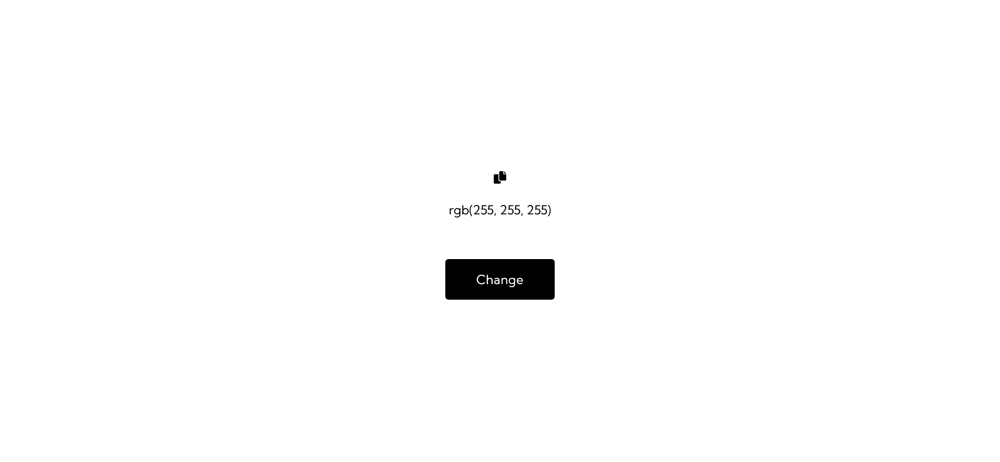

# ICodeThis - Background Changer

This is a solution to a challenge "Make Me Functional" from the website [ICodeThis](https://icodethis.com/modes/functional/14).

## Table of contents
- [Task](#task)
- [Screenshot](#screenshot)
- [Links](#links)
- [Built with](#built-with)
- [Author](#author)

## Screenshot

## Task

Make Me Functional
In this mode, you are given the HTML and CSS template and your focus should be on adding the required functionality with JS.

Implement the following functionalities:

- clicking on the “Change” button should generate a random background color for the entire &lt;body&gt;;
- the RGB value of the randomly generated color should be shown below the “Change” button, instead of the current rgb(255, 255, 255) value.

P.S. The challenge does not allow changes to the HTML and CSS code. However, I made the following modifications:
- changed the font;
- adjusted the button's letter spacing;
- added two new classes (dark-text and light-text);
- added a copy button using the Font Awesome Library;
- implemented a background brightness check (the text color in the RGB code changes to either white or black depending on the background’s brightness).

## Links

[Background Changer Page](https://axinitm.github.io/ICodeThis-Background-Changer/)

## Built with

- HTML;
- CSS;
- Vanilla JS.

## Author

- Website - [Andrei Martinenko](https://www.frontender.biz)
- Github - [@AxinitM](https://github.com/AxinitM)
- ICodeThis - [Axinit](https://icodethis.com/Axinit)
